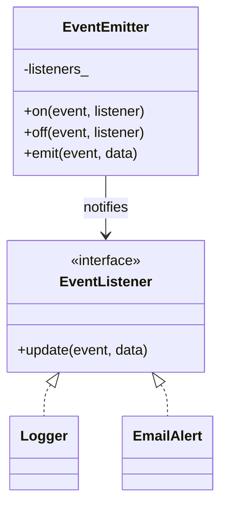

# Observer Pattern

**Observer** (Publish–Subscribe một-nhiều): khi **Subject** đổi trạng thái, mọi **Observer** đã đăng ký được thông báo, không cần Subject biết lớp cụ thể của từng listener.

---

## 1. Cấu trúc

1. **Observer** (`EventListener`): `update(event, data)`.
2. **Subject** (`EventEmitter`): `on` / `off` / `emit` theo tên sự kiện.
3. **Concrete Observer**: `Logger`, `EmailAlert`.

Ví dụ dùng map `event → danh sách listener` (nhiều kênh), không chỉ một danh sách chung.

---

## 2. Sơ đồ (UML / Mermaid)

---

## 3. Đánh giá

### Ưu điểm
* Subject và Observer lỏng (decouple).
* Thêm listener mới không sửa emitter.
* Phù hợp GUI, log, alert, event bus.

### Nhược điểm
* Thứ tự notify khó đoán; vòng phụ thuộc (A emit → B emit → A) có thể lặp.
* **Dangling pointer**: ví dụ giữ `EventListener*` không sở hữu. Nếu listener bị hủy trước khi `off`, `emit` là undefined behavior.

---

## 4. Khi nào dùng

* Một nguồn sự kiện, nhiều phản ứng độc lập.
* Không dùng khi chỉ có 1-1 và có thể gọi hàm trực tiếp — Observer thêm phức tạp.

So với Mediator: Observer là thông báo lan tỏa; Mediator điều phối tương tác *giữa* các object qua một trung tâm.

---

## 5. C++ trong ví dụ này

* Con trỏ không sở hữu: `Logger` và `EmailAlert` **phải sống lâu hơn** `EventEmitter`, hoặc `off` trước khi hủy.
* `off` dùng `std::remove` + `erase`.
* Production: `std::weak_ptr`, token unsubscribe, hoặc signal/slot (`std::function` + id).

File: [`observer.cpp`](observer.cpp)
