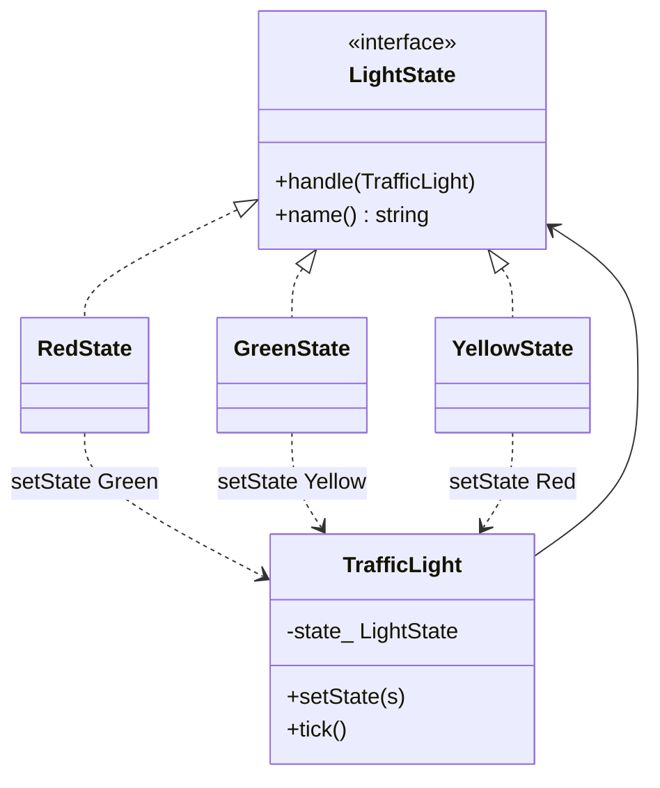

# State Pattern

**State** cho phép object đổi hành vi khi trạng thái nội bộ đổi — nhìn từ ngoài như thể đổi class. Mỗi trạng thái là một lớp; **Context** ủy quyền hành vi cho state hiện tại.

---

## 1. Cấu trúc

1. **Context** (`TrafficLight`): giữ `unique_ptr<LightState>`, `tick()` gọi `state_->handle(*this)`.
2. **State** (`LightState`): `handle`, `name`.
3. **Concrete State**: `RedState` / `GreenState` / `YellowState` — mỗi cái biết state kế tiếp.

Chuyển trạng thái: state hiện tại gọi `light.setState(...)`.

---

## 2. Sơ đồ (UML / Mermaid)

---

## 3. Đánh giá

### Ưu điểm
* Bỏ `switch (state)` khổng lồ trong Context.
* Thêm state mới = thêm lớp, ít sửa Context.
* Chuyển trạng thái nằm gần logic của state đó.

### Nhược điểm
* Nhiều lớp nhỏ; với 2–3 state đơn giản, enum + switch dễ đọc hơn.
* Object state cấp phát trên heap mỗi lần chuyển (ví dụ này).

---

## 4. Khi nào dùng / vs Strategy

* Máy trạng thái (protocol, UI wizard, đèn giao thông, connection TCP).
* **Strategy**: client *chọn* thuật toán, các strategy độc lập.
* **State**: *tự* chuyển theo sự kiện; thứ tự state có nghĩa.

---

## 5. C++ trong ví dụ này

* `unique_ptr<LightState>` — Context sở hữu state.
* Khai báo `handle` trên concrete class, định nghĩa sau khi `TrafficLight` đủ — tránh circular type cho `setState`.
* Tối ưu nhúng: state **stateless** có thể là singleton/static instance, Context chỉ giữ pointer, không `make_unique` mỗi tick.

File: [`state.cpp`](state.cpp)
