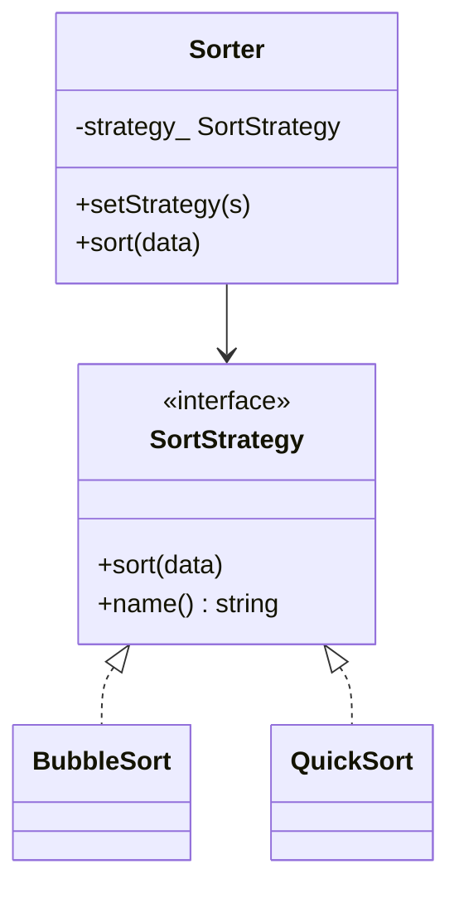

# Strategy Pattern

**Strategy** định nghĩa một họ thuật toán, đóng gói từng cái, và cho phép thay lẫn nhau lúc chạy. Context không chứa `if` chọn thuật toán.

---

## 1. Cấu trúc

1. **Strategy** (`SortStrategy`): `sort`, `name`.
2. **Concrete Strategy**: `QuickSort`, `BubbleSort`.
3. **Context** (`Sorter`): giữ strategy, ủy quyền `sort()`.

Client `setStrategy` khi cần đổi thuật toán (dữ liệu nhỏ → bubble, lớn → quick).

---

## 2. Sơ đồ (UML / Mermaid)

---

## 3. Đánh giá

### Ưu điểm
* Thêm thuật toán mới không sửa Context (OCP).
* Tách “làm gì” (Context) khỏi “làm thế nào” (Strategy).
* Dễ test từng thuật toán riêng.

### Nhược điểm
* Client phải hiểu khi nào chọn strategy nào.
* Mỗi strategy là một lớp (+ vtable); trên MCU, CRTP / template có thể rẻ hơn.
* `std::function` / lambda thường đủ, không cần hierarchy.

---

## 4. Khi nào dùng / phân biệt

* Nhiều cách làm **cùng một việc** (sort, compress, retry, allocate).
* **State**: hành vi gắn máy trạng thái, tự chuyển.
* **Template Method**: khung thuật toán cố định trong base class; subclass chỉ override bước — quyết định lúc **compile** qua kế thừa, không hoán đổi object lúc chạy.

---

## 5. C++ trong ví dụ này

* `unique_ptr<SortStrategy>` + `std::move` khi `setStrategy`.
* Destructor ảo trên Strategy.
* Bubble sort dùng `j + 1 < data.size() - i` để tránh underflow `size_t` khi `data` rỗng.

File: [`strategy.cpp`](strategy.cpp)
