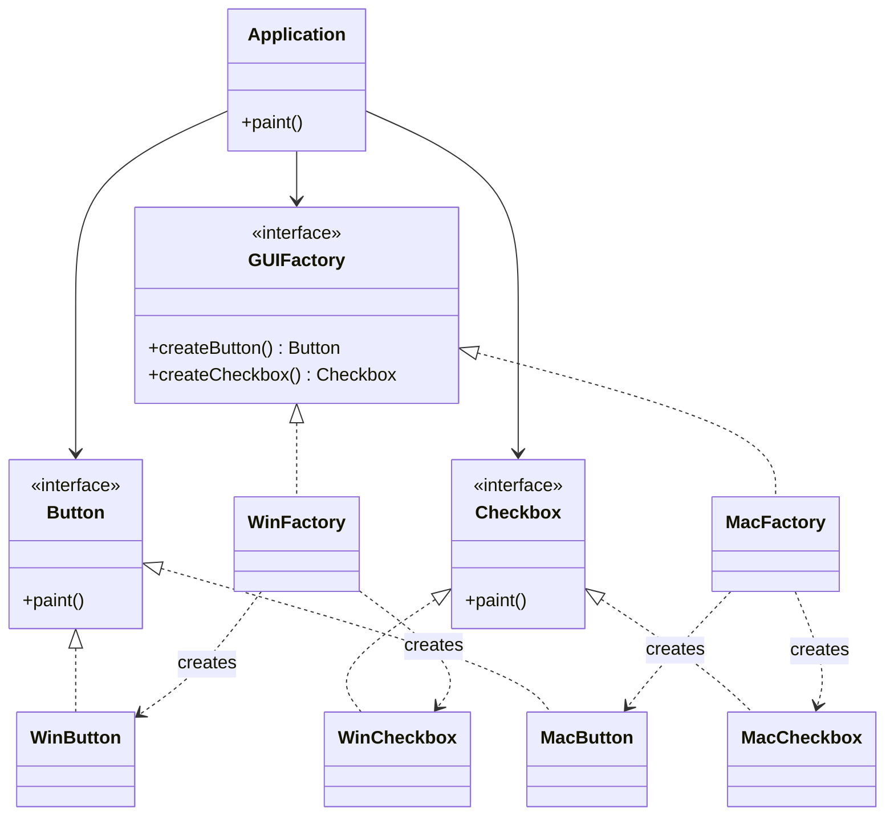

# Abstract Factory Pattern

**Abstract Factory** là mẫu khởi tạo (Creational) cung cấp một giao diện để tạo **họ các đối tượng liên quan** (ví dụ Button + Checkbox cùng một hệ điều hành) mà client không cần biết lớp cụ thể.

Khác Factory Method: Factory Method tạo **một** loại sản phẩm; Abstract Factory tạo **nhiều** loại sản phẩm **khớp nhau**.

---

## 1. Cấu trúc

1. **Abstract Products**: giao diện từng loại sản phẩm (`Button`, `Checkbox`).
2. **Concrete Products**: bộ sản phẩm theo nền tảng (`WinButton`/`WinCheckbox`, `MacButton`/`MacCheckbox`).
3. **Abstract Factory**: khai báo factory method cho từng loại sản phẩm (`createButton`, `createCheckbox`).
4. **Concrete Factory**: một factory cho mỗi họ (`WinFactory`, `MacFactory`) — luôn trả về sản phẩm cùng “gia đình”.
5. **Client**: chỉ phụ thuộc `GUIFactory` và các abstract product.

---

## 2. Sơ đồ (UML / Mermaid)

---

## 3. Đánh giá

### Ưu điểm
* Client không `new` trực tiếp lớp cụ thể; đổi nền tảng = đổi factory.
* Các sản phẩm trong cùng họ luôn khớp nhau (không trộn WinButton với MacCheckbox).
* Tuân OCP khi thêm **một họ mới** (thêm factory + bộ product).

### Nhược điểm
* Thêm **một loại sản phẩm mới** (ví dụ `Slider`) phải sửa mọi factory — nặng hơn Factory Method.
* Số lớp tăng nhanh (mỗi họ × mỗi loại sản phẩm).

---

## 4. Khi nào dùng

* Cần tạo bộ widget/driver/codec **đi cùng nhau** theo cấu hình (OS, board, protocol).
* Client không được phụ thuộc header của từng lớp cụ thể.

Không dùng khi chỉ có một loại đối tượng — dùng Factory Method hoặc Simple Factory.

---

## 5. C++ trong ví dụ này

* Factory trả `std::unique_ptr` — client sở hữu sản phẩm, không `new`/`delete` tay.
* Destructor ảo trên mọi giao diện dùng đa hình.
* `Application` nhận factory qua `unique_ptr` rồi `move`; factory có thể chết sau khi tạo xong sản phẩm.

File: [`abstract_factory.cpp`](abstract_factory.cpp)
