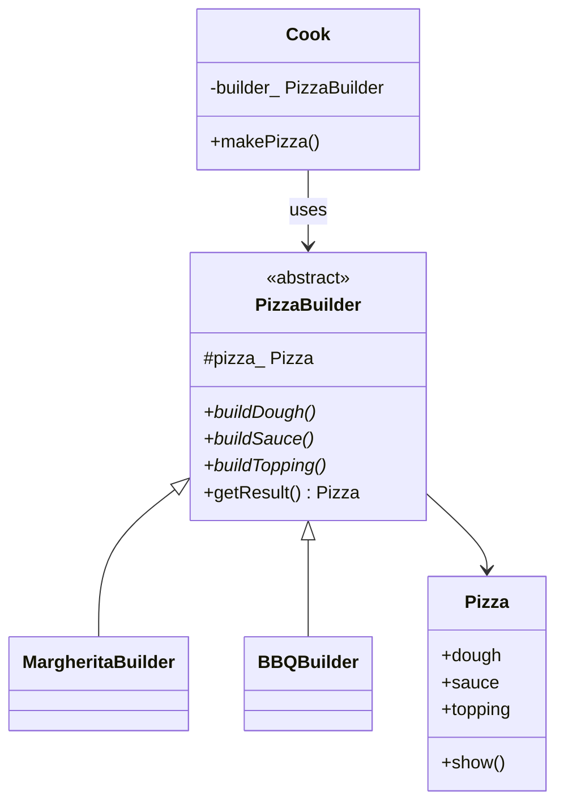

# Builder Pattern

**Builder** tách **quy trình xây dựng** một đối tượng phức tạp khỏi **biểu diễn cuối**. Cùng một chuỗi bước (`buildDough` → `buildSauce` → `buildTopping`) có thể cho ra nhiều biến thể (Margherita, BBQ).

---

## 1. Cấu trúc

1. **Product**: đối tượng phức tạp (`Pizza`) — nhiều trường, không tiện gán hết trong một constructor.
2. **Builder**: giao diện từng bước xây dựng.
3. **Concrete Builder**: điền từng phần của product (`MargheritaBuilder`, `BBQBuilder`).
4. **Director** (`Cook`): biết **thứ tự** các bước; không biết chi tiết từng biến thể.

Client chọn builder, giao cho director, rồi lấy kết quả từ builder.

---

## 2. Sơ đồ (UML / Mermaid)

---

## 3. Đánh giá

### Ưu điểm
* Constructor không phình thành 10+ tham số (telescoping constructor).
* Cùng quy trình, nhiều biểu diễn.
* Director gom thứ tự bước — dễ đổi quy trình ở một chỗ.

### Nhược điểm
* Thêm lớp so với `Pizza{dough, sauce, topping}` gán trực tiếp.
* Product có thể ở trạng thái dở nếu client quên gọi đủ bước (Director giúp giảm lỗi này).

---

## 4. Khi nào dùng

* Đối tượng có nhiều phần tùy chọn, hoặc nhiều cấu hình hợp lệ khác nhau.
* Cần dựng từng bước (config file, protocol frame, pipeline).

Không dùng cho struct nhỏ, ít field — constructor hoặc designated initializer đủ.

So với Factory: Factory trả object **đã xong** theo loại; Builder **lắp** object theo bước.

---

## 5. C++ trong ví dụ này

* `Cook` giữ `PizzaBuilder&` — không sở hữu builder, tránh dangling nếu dùng raw pointer mà quên lifetime.
* `getResult()` trả `Pizza` theo giá trị (copy nhỏ, đủ cho demo).
* C++ hiện đại thường dùng **fluent builder** (`setDough().setSauce().build()`) thay Director; ý tưởng vẫn là tách dựng và biểu diễn.

File: [`builder.cpp`](builder.cpp)
