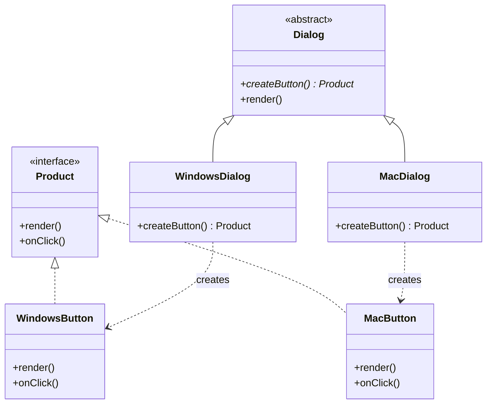

# Factory Method Pattern

**Factory Method** là một mẫu thiết kế khởi tạo (Creational Design Pattern) cho phép định nghĩa một giao diện để tạo đối tượng, nhưng để các lớp con quyết định lớp nào sẽ được khởi tạo. Mẫu thiết kế này giúp một lớp trì hoãn việc khởi tạo đối tượng cho các lớp con kế thừa nó.

---

## 1. Cấu trúc 3 Tầng (Layers) trong Thiết kế

Cách phân chia 3 tầng của bạn rất thực tế và trực quan. Để chuẩn hóa về mặt kỹ thuật và sửa một số lỗi chính tả, ta có thể mô tả chi tiết như sau:

1. **Tầng kiến trúc chung (Core Architecture Layer)**:
   * Đây là tầng cao nhất mà toàn bộ hệ thống phải tuân theo để đảm bảo tính thống nhất và chặt chẽ.
   * Chứa khai báo cơ bản: Giao diện sản phẩm (**Product Interface**) và lớp tạo dựng trừu tượng (**Abstract Creator**).
   
2. **Tầng logic quyết định sản phẩm (Creator Layer)**:
   * Chứa các lớp tạo dựng cụ thể (**Concrete Creators**).
   * Lớp này kế thừa từ `Abstract Creator` và ghi đè (override) phương thức nhà máy (Factory Method) để quyết định chính xác loại sản phẩm nào sẽ được tạo ra dựa trên điều kiện thực tế (như hệ điều hành, cấu hình, hoặc lựa chọn của người dùng).

3. **Tầng sản phẩm thực tế (Concrete Products Layer)**:
   * Chứa các sản phẩm thực tế (**Concrete Products**), mỗi loại được đóng gói thành một lớp riêng biệt kế thừa từ `Product Interface`.
   * Các sản phẩm này hoạt động độc lập và dễ dàng mở rộng mà không ảnh hưởng lẫn nhau.

---

## 2. Sơ đồ Hoạt động (UML / Mermaid)

---

## 3. Đánh giá Mẫu Thiết kế

### 👍 Ưu điểm (Pros)
* **Tránh phụ thuộc cứng (Decoupling):** Lớp xử lý nghiệp vụ chính (`Creator`) không cần biết trực tiếp lớp sản phẩm cụ thể (`Concrete Product`) mà nó sử dụng.
* **Single Responsibility Principle (SRP):** Tách biệt logic tạo đối tượng ra khỏi logic sử dụng đối tượng.
* **Open/Closed Principle (OCP):** Khi thêm sản phẩm mới (ví dụ: `LinuxButton`), ta chỉ cần tạo thêm các lớp con mới mà không cần chỉnh sửa bất kỳ dòng mã nguồn hiện tại nào của hệ thống.

### 👎 Nhược điểm (Cons)
* **Tăng số lượng lớp (Class Explosion):** Với mỗi loại sản phẩm mới, bạn phải tạo thêm ít nhất 2 lớp mới (`Concrete Product` và `Concrete Creator`), khiến hệ thống nhiều file và phức tạp hơn nếu số lượng sản phẩm quá lớn.

---

## 4. Phân biệt nhanh với Simple Factory

* **Simple Factory:** Chỉ là một lớp/phương thức duy nhất có chứa câu lệnh điều kiện (`if-else` hoặc `switch-case`) để trả về đối tượng tương ứng. Nhược điểm là vi phạm nguyên lý OCP vì mỗi lần thêm sản phẩm mới, ta phải sửa lại phương thức này.
* **Factory Method:** Sử dụng **tính kế thừa và đa hình** để loại bỏ câu lệnh điều kiện tạo đối tượng, chuyển giao quyền quyết định khởi tạo cho các lớp con kế thừa.
