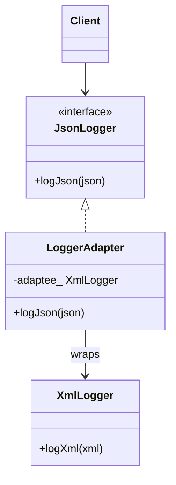

# Adapter Pattern

**Adapter** chuyển giao diện của một lớp sẵn có (**Adaptee**) thành giao diện mà client đang chờ (**Target**), để hai bên không tương thích vẫn làm việc được.

---

## 1. Cấu trúc

1. **Target** (`JsonLogger`): API client gọi.
2. **Adaptee** (`XmlLogger`): lớp cũ / thư viện ngoài, API khác.
3. **Adapter**: bọc Adaptee, dịch `logJson` → `logXml`.

Hai cách cài:

* **Object Adapter** (composition): `LoggerAdapter` *có một* `XmlLogger` — linh hoạt, ưu tiên trong C++.
* **Class Adapter** (đa kế thừa): `LoggerAdapter2` kế thừa Target + Adaptee — gọn nhưng cứng, Adaptee phải là class có thể kế thừa.

---

## 2. Sơ đồ (UML / Mermaid)

---

## 3. Đánh giá

### Ưu điểm
* Tái sử dụng code cũ / thư viện không sửa được.
* Client không phụ thuộc Adaptee.
* Object Adapter dễ bọc nhiều Adaptee khác nhau.

### Nhược điểm
* Thêm lớp trung gian, luồng gọi khó đọc hơn.
* Class Adapter phụ thuộc đa kế thừa và không bọc được object có sẵn (chỉ bọc kiểu).

---

## 4. Khi nào dùng / phân biệt

* Dùng khi **giao diện không khớp**, logic bên trong vẫn dùng được.
* **Proxy**: cùng giao diện, kiểm soát truy cập / lazy load.
* **Decorator**: cùng giao diện, *thêm* hành vi, xếp chồng được.
* **Facade**: đơn giản hóa *cả hệ con*, không phải dịch một API sang API khác.

---

## 5. C++ trong ví dụ này

* Object Adapter dùng member `XmlLogger` — không cần virtual trên Adaptee.
* Class Adapter `private XmlLogger` để không lộ `logXml` ra client.
* Destructor ảo trên `JsonLogger`.

File: [`adapter.cpp`](adapter.cpp)
