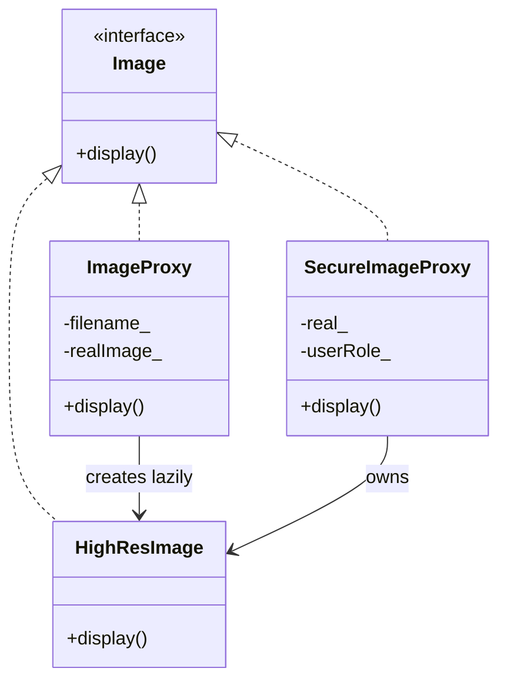

# Proxy Pattern

**Proxy** đứng thay một đối tượng khác (**Real Subject**), cùng giao diện (**Subject**), để kiểm soát việc truy cập: trì hoãn tạo đối tượng đắt, phân quyền, cache, remote call…

---

## 1. Cấu trúc

1. **Subject** (`Image`): giao diện chung.
2. **Real Subject** (`HighResImage`): việc thật (I/O đĩa).
3. **Proxy**:
   * **Virtual Proxy** (`ImageProxy`): tạo `HighResImage` lần đầu `display()` — lazy init.
   * **Protection Proxy** (`SecureImageProxy`): chỉ `admin` được `display()`.

Client chỉ nói chuyện với `Image`.

---

## 2. Sơ đồ (UML / Mermaid)

---

## 3. Đánh giá

### Ưu điểm
* Client không đổi khi thêm kiểm soát (lazy, ACL, logging).
* Virtual Proxy tránh trả chi phí ngay lúc tạo proxy.

### Nhược điểm
* Thêm indirection; Protection Proxy trong ví dụ **vẫn load** ảnh lúc construct — chỉ chặn `display()`, không tiết kiệm I/O.
* Dễ nhầm với Adapter (đổi API) hoặc Decorator (thêm hành vi, thường xếp chồng).

---

## 4. Khi nào dùng

* Tài nguyên đắt (file lớn, kết nối mạng, GPU buffer).
* Cần cổng kiểm soát (role, quota) trước khi gọi object thật.
* Remote Proxy (stub) — ngoài phạm vi ví dụ này.

Không dùng nếu object rẻ và không cần kiểm soát — gọi trực tiếp Real Subject.

---

## 5. C++ trong ví dụ này

* `ImageProxy` giữ `unique_ptr<HighResImage>` + `mutable` vì `display()` không đổi API nhưng cache object.
* Destructor ảo trên `Image`.
* Listener/proxy không dùng raw `new`.

File: [`proxy.cpp`](proxy.cpp)
