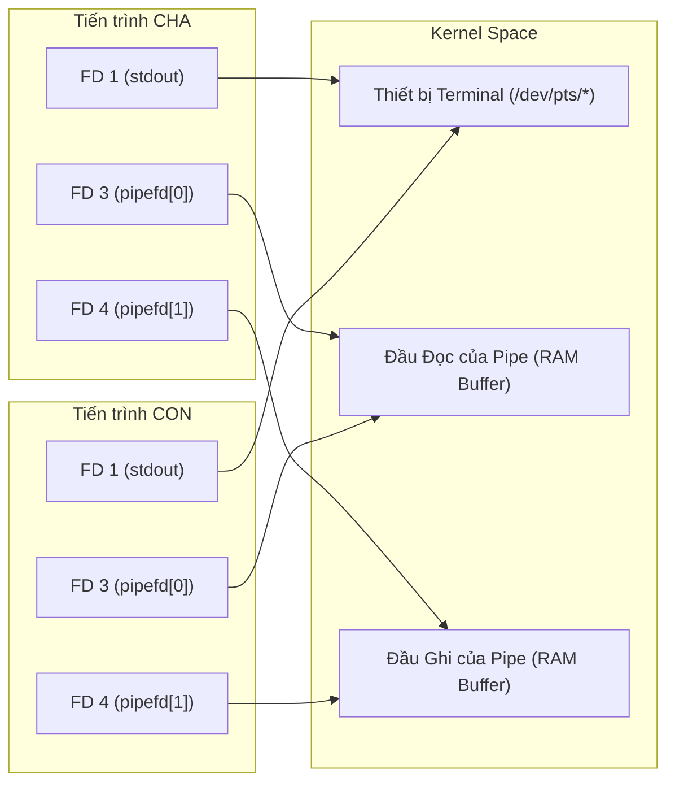
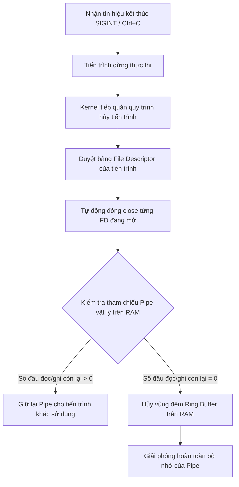

# Ghi Chú và Câu Hỏi Thường Gặp (IPC Pipe)

Tài liệu này lưu trữ các câu hỏi và câu trả lời liên quan đến cơ chế hoạt động của Pipe và quản lý tài nguyên hệ thống trong Linux.

---

## 1. Phân Loại Pipe: Anonymous Pipe vs. Named Pipe (FIFO)

Trong Linux, Pipe là một cơ chế giao tiếp liên tiến trình (IPC) cho phép truyền dữ liệu dưới dạng dòng byte (byte stream) theo mô hình First-In-First-Out (FIFO). Có hai loại pipe chính với các cơ chế hoạt động khác nhau:

### 1.1. Anonymous Pipe (Đường ống vô danh)
* **Định nghĩa**: Là đường ống dẫn dữ liệu tạm thời, không có tên trên hệ thống tập tin thực tế. Nó chỉ tồn tại dưới dạng một vùng đệm (Ring Buffer) trong RAM và được quản lý bởi hệ thống tập tin ảo của nhân Kernel (`pipefs`).
* **Cách tạo**: Được tạo trong code C thông qua hàm hệ thống `pipe(int pipefd[2])`. Hàm này sinh ra hai file descriptor:
  * `pipefd[0]`: Đầu đọc (read end).
  * `pipefd[1]`: Đầu ghi (write end).
* **Cơ chế hoạt động**:
  * **Tính một chiều (Half-Duplex)**: Dữ liệu chỉ đi từ đầu ghi sang đầu đọc.
  * **Ràng buộc tiến trình**: Chỉ giao tiếp được giữa các tiến trình có **quan hệ họ hàng trực tiếp** (ví dụ: tiến trình cha và con được nhân bản bằng hàm `fork()`). Khi `fork()`, tiến trình con kế thừa bảng mô tả file của cha, từ đó dùng chung đường ống này.
  * **Vòng đời (Lifetime)**: Gắn liền với tiến trình. Khi tất cả các tiến trình tham chiếu đến đầu đọc và đầu ghi của pipe kết thúc (hoặc đóng các file descriptor này), pipe sẽ tự động bị Kernel hủy hoàn toàn khỏi bộ nhớ RAM.

### 1.2. Named Pipe / FIFO (Đường ống có tên)
* **Định nghĩa**: Là một tệp đặc biệt xuất hiện trên hệ thống tập tin (thường hiển thị chữ `p` ở đầu dòng khi chạy lệnh `ls -l`). Nó đóng vai trò là một điểm kết nối (endpoint) cho phép các tiến trình giao tiếp.
* **Cách tạo**: Được tạo bằng lệnh shell `mkfifo <tên_file>` hoặc hàm hệ thống `mkfifo(const char *pathname, mode_t mode)`.
* **Cơ chế hoạt động**:
  * **Giao tiếp không biên giới**: Cho phép giao tiếp giữa **hai tiến trình độc lập hoàn toàn** (không cần quan hệ cha-con). Hai tiến trình chỉ cần mở cùng một tệp FIFO bằng hàm `open()` chuẩn của Linux (một tiến trình mở với cờ `O_RDONLY` để đọc, một tiến trình mở với cờ `O_WRONLY` để ghi).
  * **Hành vi chặn khi mở (Blocking Open)**: Mặc định, một tiến trình khi gọi `open()` để đọc FIFO sẽ bị chặn (block) lại cho đến khi có một tiến trình khác gọi `open()` để ghi vào FIFO đó, và ngược lại.
  * **Vòng đời (Lifetime)**: Bền vững (Persistent). Khi tiến trình kết thúc, dữ liệu trong bộ đệm RAM bị xóa, nhưng **tệp đại diện** của Named Pipe vẫn nằm trên ổ đĩa cho đến khi bị xóa một cách chủ động bằng lệnh `rm` hoặc hàm hệ thống `unlink()`.

### 1.3. Bảng so sánh nhanh hai loại Pipe

| Đặc tính | Anonymous Pipe | Named Pipe (FIFO) |
| :--- | :--- | :--- |
| **Tên trên file system** | Không có | Có (dưới dạng một file đặc biệt) |
| **Cách tạo** | Hàm `pipe()` | Lệnh `mkfifo` hoặc hàm `mkfifo()` |
| **Quan hệ tiến trình** | Bắt buộc có quan hệ cha-con (`fork`) | Bất kỳ tiến trình nào trong hệ thống |
| **Thời gian tồn tại** | Tự hủy khi không còn tiến trình nào sử dụng | File tồn tại mãi mãi trên đĩa cho đến khi bị xóa |

---

## 2. Cơ Chế Hoạt Động Của Hàm `read()` Trên Pipe: Blocking vs. Non-blocking

Hàm `read()` trên một đầu đọc của pipe (`pipefd[0]` hoặc file FIFO đã mở để đọc) có hành vi phụ thuộc vào cấu hình file descriptor và trạng thái của đầu ghi.

### 2.1. Chế độ mặc định: Blocking (Chặn)
Đây là chế độ mặc định khi tạo pipe. Khi gọi `read(pipefd[0], buffer, count)`:

* **Trường hợp 1: Pipe đang có dữ liệu**
  * `read()` lập tức đọc tối đa `count` byte dữ liệu hiện có vào `buffer` và trả về số byte thực tế đã đọc. Nếu dữ liệu hiện có ít hơn `count`, hàm đọc vẫn trả về ngay mà không đợi đủ.
* **Trường hợp 2: Pipe trống (không có dữ liệu)**
  * **Nếu đầu ghi vẫn đang mở** (ở tiến trình hiện tại hoặc tiến trình khác):
    * Tiến trình gọi `read()` sẽ bị **chặn (block)** lại. Hệ điều hành đưa tiến trình này vào trạng thái ngủ (`interruptible sleep`). Tiến trình không tiêu tốn tài nguyên CPU trong khi chờ đợi.
    * Nó sẽ được đánh thức khi: có dữ liệu ghi vào đầu ghi, hoặc đầu ghi bị đóng hoàn toàn, hoặc nhận được tín hiệu (Signal) ngắt.
  * **Nếu tất cả các đầu ghi đã bị đóng hoàn toàn**:
    * Hàm `read()` sẽ **không chặn** mà trả về `0` ngay lập tức. Đây chính là ký hiệu báo hiệu kết thúc file (EOF - End-of-File).

### 2.2. Chế độ cấu hình: Non-blocking (Không chặn)
Để chuyển đổi, ta thiết lập cờ `O_NONBLOCK` thông qua hàm hệ thống `fcntl()`:

```c
#include <fcntl.h>
#include <unistd.h>

// Lấy các cờ hiện tại của file descriptor đầu đọc
int flags = fcntl(pipefd[0], F_GETFL, 0);

// Thiết lập lại cờ bằng cách gộp thêm O_NONBLOCK
fcntl(pipefd[0], F_SETFL, flags | O_NONBLOCK);
```

Khi ở chế độ `O_NONBLOCK` mà **pipe đang trống**:
* **Nếu đầu ghi vẫn mở**: `read()` trả về giá trị `-1` ngay lập tức, đồng thời biến toàn cục `errno` được gán giá trị `EAGAIN` hoặc `EWOULDBLOCK` (thử lại sau).
* **Nếu đầu ghi đã đóng**: `read()` vẫn trả về `0` ngay lập tức (EOF).

---

## 3. Bản Chất Kế Thừa File Descriptor và Chia Sẻ Pipe Sau Khi `fork()`

Một trong những nguồn gây hiểu nhầm phổ biến nhất khi mới làm quen với lập trình hệ thống là mối quan hệ giữa các File Descriptor (FD) của tiến trình con và cha sau lệnh `fork()`.

### 3.1. Cha và con chia sẻ chung một Pipe duy nhất
Khi tiến trình cha gọi hàm `pipe()`, Kernel cấp phát **một** đường ống duy nhất nằm trên bộ nhớ RAM. Khi tiến trình cha tiếp tục gọi `fork()`:
* **Không có pipe thứ hai nào được tạo ra.**
* Tiến trình con được nhân bản một bảng mô tả file (File Descriptor Table) giống hệt cha.
* Bảng này chứa các liên kết chỉ mục (chỉ số FD) trỏ đến cùng các cấu trúc tệp đang mở (Open File Descriptions) trong Kernel.



### 3.2. Sự khác biệt về đích đến của dữ liệu (Terminal vs. Pipe Buffer)

Việc truyền dữ liệu và hiển thị hoạt động theo các bước phân tách rõ ràng về mặt vật lý:

1. **Ghi vào Pipe (Ẩn danh)**:
   * Khi tiến trình cha gọi `write(pipefd[1], msg, ...)` (FD 4): Dữ liệu được đẩy vào vùng đệm RAM của Pipe trong Kernel. Hành động này **không** trỏ tới thiết bị Terminal, do đó không có gì hiển thị lên màn hình.
2. **Đọc từ Pipe (Ẩn danh)**:
   * Tiến trình con gọi `read(pipefd[0], buffer, ...)` (FD 3): Hàm này lấy dữ liệu từ vùng đệm RAM của Pipe ra lưu vào biến `buffer` nằm trong vùng nhớ cục bộ của tiến trình con. Hành động này cũng hoàn toàn ẩn danh đối với Terminal.
3. **In ra màn hình (Hiển thị)**:
   * Chỉ khi tiến trình con gọi `printf("[CHILD]: %s\n", buffer)` hoặc ghi vào đầu ra tiêu chuẩn `write(1, buffer, ...)` (FD 1): Dữ liệu mới được gửi tới thiết bị Terminal để hiển thị lên màn hình.

> [!IMPORTANT]  
> Cả hai tiến trình đều có thể viết ra màn hình terminal là vì **FD 1 (stdout)** của chúng đều kế thừa liên kết trỏ về cùng một file thiết bị Terminal đại diện cho cửa sổ dòng lệnh đang chạy.

---

## 4. Tắt đột ngột bằng `Ctrl + C` khi chưa close pipe có sinh rác hệ thống không?

**Không.** Khi bạn nhấn `Ctrl + C` (gửi tín hiệu `SIGINT` kết thúc tiến trình đột ngột), hệ điều hành sẽ tự động giải phóng toàn bộ tài nguyên.

### 4.1. Cơ chế thu hồi tài nguyên tự động của Kernel



1. **Tự động đóng các File Descriptor (FD)**:
   Mỗi tiến trình sở hữu một bảng File Descriptor riêng. Khi tiến trình bị hủy, Kernel sẽ duyệt qua bảng này và tự động gọi giải phóng hệ thống cho mọi FD chưa được đóng (bao gồm cả các đầu pipe `pipefd[0]`, `pipefd[1]`).
2. **Hủy bộ nhớ Anonymous Pipe**:
   * Khi Kernel tự động đóng các FD ở bước 1, bộ đếm tham chiếu (reference count) của đầu đọc/ghi tương ứng trong Kernel sẽ giảm đi.
   * Khi không còn tiến trình nào trong hệ thống liên kết với đầu đọc hoặc đầu ghi của Anonymous Pipe đó nữa (bộ đếm giảm về `0`), Kernel sẽ tự động giải phóng vùng đệm RAM (Ring Buffer) đã cấp phát cho pipe. Nhờ vậy, **hoàn toàn không xảy ra rò rỉ bộ nhớ**.

### 4.2. So sánh khả năng dọn dẹp rác khi bị ngắt đột ngột

Dưới đây là bảng đối chiếu khả năng tự dọn dẹp của Pipe với các kỹ thuật IPC khác khi bị đóng đột ngột:

| Loại IPC | Bản chất tài nguyên | Tự động giải phóng khi tắt đột ngột? | Hệ quả khi tắt đột ngột |
| :--- | :--- | :--- | :--- |
| **Anonymous Pipe** | Vùng đệm RAM ảo liên kết với các File Descriptor của tiến trình. | **Có hoàn toàn** | Không để lại bất kỳ rác bộ nhớ hay tệp tin nào. |
| **Named Pipe (FIFO)** | File đặc biệt trên ổ cứng + Vùng đệm RAM ảo. | **Một phần** | Vùng đệm RAM tự động giải phóng, nhưng **tệp tin đặc biệt** vẫn nằm lại trên ổ cứng và cần được xóa bằng lệnh `rm` hoặc hàm `unlink()`. |
| **Shared Memory (System V / POSIX)** | Phân vùng RAM dùng chung đăng ký toàn hệ thống. | **Không** | Vẫn chiếm dụng RAM cho tới khi được xóa thủ công (bằng lệnh `ipcrm`, file ảo `/dev/shm/*` hoặc khi khởi động lại máy). |
| **Semaphores (System V / POSIX)** | Bộ biến đếm/đèn hiệu đồng bộ toàn hệ thống. | **Không** | Vẫn tồn tại trong hệ thống, có thể gây kẹt tài nguyên (deadlock) cho các tiến trình chạy sau nếu không được dọn dẹp chủ động. |
