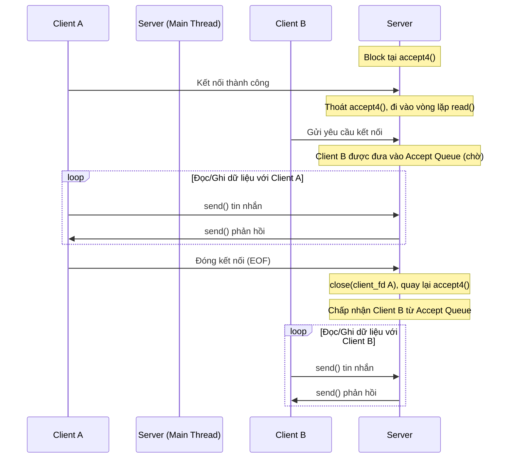

# Các Mô Hình Thiết Kế Server (Iterative vs Concurrent Server)

Tài liệu này phân tích chi tiết cơ chế hoạt động, hạn chế của mô hình server hiện tại (tuần tự) và các phương án cải tiến để phục vụ nhiều client đồng thời trong hệ thống Unix/Linux.

---

## 1. Vấn đề của mô hình hiện tại: Iterative Server (Server Tuần Tự)

Mô hình server trong chương trình `socket_default_server.c` hiện tại là **Iterative Server** (Server xử lý tuần tự/lặp). Nó chạy trên một luồng duy nhất (single-threaded) và thực hiện các bước theo thứ tự tuyến tính:



### Cơ chế hoạt động & Hạn chế:
* **Hành vi:** Khi Server đang xử lý dữ liệu cho Client A trong vòng lặp `while (read(client_fd, ...))`, luồng thực thi bị chặn tại đây. 
* **Hạn chế:** Nếu Client B kết nối tới, hệ điều hành chỉ lưu kết nối của Client B vào hàng đợi (**Accept Queue**). Client B sẽ bị treo (chờ đợi) cho đến khi Client A ngắt kết nối hoàn toàn và Server quay lại gọi `accept4()`.
* **Rủi ro:** Nếu Client A duy trì kết nối vô hạn mà không gửi gì cả, toàn bộ Server sẽ bị "tê liệt" đối với tất cả các client khác.

---

## 2. Các Phương Án Giải Quyết (Concurrent Server)

Để phục vụ song song nhiều client cùng lúc, chúng ta cần chuyển đổi sang mô hình **Concurrent Server**. Dưới đây là 3 phương án phổ biến trên Linux:

### Phương án 1: Đa Tiến Trình (Multi-processing với `fork()`)
Với mỗi kết nối mới được chấp nhận, Server sẽ nhân bản chính nó ra một tiến trình con để phục vụ client đó.

* **Cách hoạt động:**
  ```c
  while (keep_running) {
      int client_fd = accept4(server_fd, ...);
      pid_t pid = fork();
      if (pid == 0) {
          /* Tiến trình con */
          close(server_fd); // Con không cần socket lắng nghe
          handle_client(client_fd); // Chạy vòng lặp read/write ở đây
          close(client_fd);
          exit(0); // Kết thúc tiến trình con
      } else {
          /* Tiến trình cha */
          close(client_fd); // Cha không cần quản lý fd của client này nữa
          // Tiếp tục loop để accept client khác
      }
  }
  ```
* **Ưu điểm:**
  * **Cô lập tốt (Isolation):** Nếu tiến trình con xử lý Client A bị crash (lỗi phân đoạn - Segfault), nó không hề ảnh hưởng đến tiến trình cha hay các client khác.
  * **An toàn:** Không lo lắng về vấn đề đồng bộ dữ liệu (Race condition) vì mỗi tiến trình có vùng nhớ độc lập hoàn toàn.
* **Nhược điểm:**
  * **Tốn tài nguyên:** Tạo mới một tiến trình rất nặng (tốn CPU và RAM).
  * **Liên lạc phức tạp:** Nếu các client cần chia sẻ thông tin với nhau, việc thiết lập IPC (Shared Memory, Pipe...) khá phức tạp.
  * **Lỗi tiến trình thây ma (Zombie Process):** Tiến trình cha phải gọi `wait()` hoặc `waitpid()` (hoặc cấu hình `SIGCHLD`) để thu dọn tiến trình con khi kết thúc.

---

### Phương án 2: Đa Luồng (Multi-threading với `pthread`)
Thay vì tạo tiến trình mới, Server sẽ tạo một luồng (thread) mới bên trong cùng một tiến trình để phục vụ client.

* **Cách hoạt động:**
  ```c
  void* thread_handler(void* arg) {
      int client_fd = *(int*)arg;
      handle_client(client_fd);
      close(client_fd);
      free(arg);
      pthread_exit(NULL);
  }

  while (keep_running) {
      int client_fd = accept4(server_fd, ...);
      pthread_t thread_id;
      int* new_sock = malloc(sizeof(int));
      *new_sock = client_fd;
      pthread_create(&thread_id, NULL, thread_handler, (void*)new_sock);
      pthread_detach(thread_id); // Tự động giải phóng tài nguyên luồng khi chạy xong
  }
  ```
* **Ưu điểm:**
  * **Cực kỳ nhẹ:** Tạo và chuyển đổi ngữ cảnh giữa các luồng nhanh hơn tiến trình rất nhiều.
  * **Chia sẻ dữ liệu dễ dàng:** Tất cả các luồng cùng nằm chung trong một không gian địa chỉ vùng nhớ (Memory space), có thể truy cập trực tiếp vào các biến toàn cục.
* **Nhược điểm:**
  * **Vấn đề đồng bộ:** Rất dễ gặp lỗi Race Condition nếu nhiều luồng cùng ghi vào một vùng dữ liệu. Cần sử dụng các cơ chế khóa (`mutex`, `semaphore`).
  * **Thiếu an toàn (Crash chain):** Nếu bất kỳ luồng nào gặp lỗi nghiêm trọng (như truy cập sai vùng nhớ), toàn bộ tiến trình (bao gồm server và tất cả các client khác) sẽ bị dừng đột ngột.

---

### Phương án 3: Hướng Sự Kiện - Multiplexing I/O (`select`, `poll`, `epoll`)
Đây là mô hình hiệu năng cao nhất, được sử dụng trong các hệ thống lớn như Nginx, Redis. Server chỉ dùng **duy nhất 1 luồng** để quản lý hàng nghìn kết nối đồng thời.

* **Cách hoạt động:**
  * Thay vì tự block ở `read()`, Server đăng ký tất cả các File Descriptor (`server_fd` và các `client_fd`) vào một bảng quản lý sự kiện của kernel (thông qua `epoll`).
  * Hệ điều hành sẽ theo dõi giúp server. Khi nào có dữ liệu thực sự được gửi tới hoặc có kết nối mới, hệ điều hành mới đánh thức server dậy để xử lý.
  ```c
  // Pseudo-code dùng epoll
  int epoll_fd = epoll_create1(0);
  epoll_ctl(epoll_fd, EPOLL_CTL_ADD, server_fd, &ev);

  while (keep_running) {
      int nfds = epoll_wait(epoll_fd, events, MAX_EVENTS, -1);
      for (int i = 0; i < nfds; i++) {
          if (events[i].data.fd == server_fd) {
              int client_fd = accept4(server_fd, ...);
              epoll_ctl(epoll_fd, EPOLL_CTL_ADD, client_fd, &ev);
          } else {
              handle_read_write(events[i].data.fd);
          }
      }
  }
  ```
* **Ưu điểm:**
  * **Hiệu năng siêu việt (C10K):** Xử lý hàng chục nghìn kết nối đồng thời mà tốn rất ít tài nguyên hệ thống (RAM, CPU).
  * **Không tốn chi phí đổi ngữ cảnh:** Vì chỉ chạy trên một tiến trình/luồng duy nhất.
* **Nhược điểm:**
  * **Độ phức tạp cực cao:** Code viết rất khó đọc và đòi hỏi phải lập trình bất đồng bộ (Non-blocking I/O).
  * **Không tận dụng được đa nhân CPU:** Nếu muốn tận dụng đa nhân, phải kết hợp thêm mô hình Multi-process/Multi-thread hoặc chạy nhiều worker độc lập.
