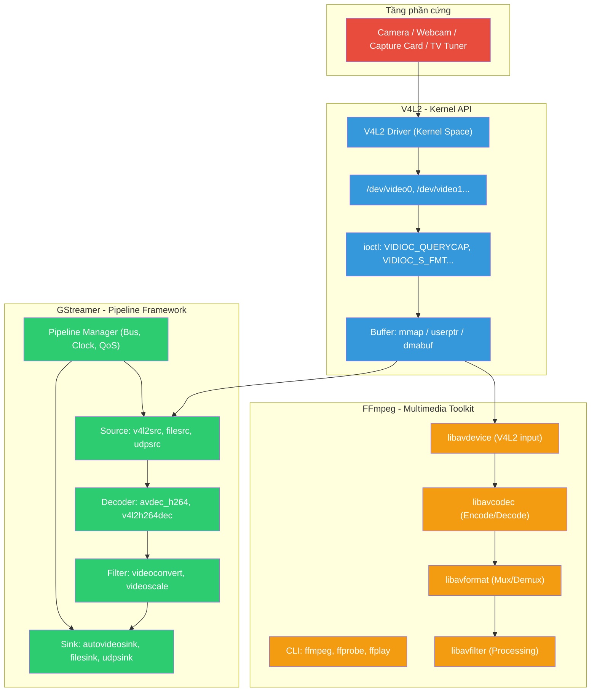
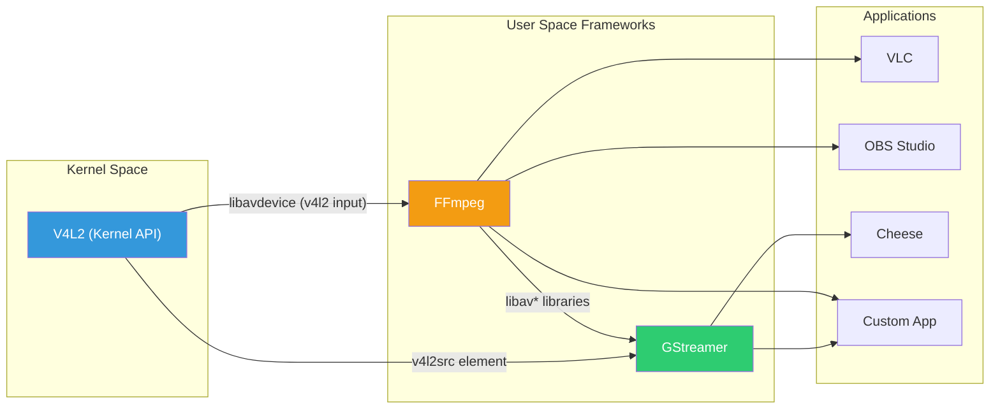
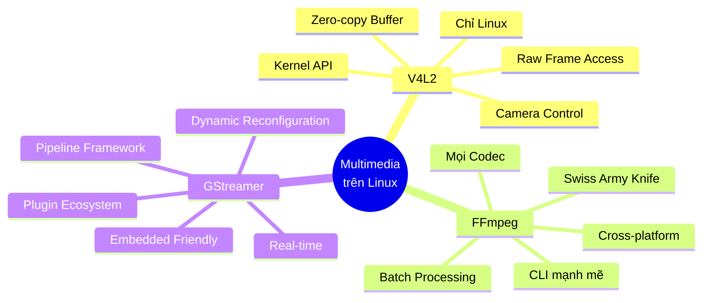

# So sánh V4L / V4L2 vs FFmpeg vs GStreamer

> Tài liệu phân tích chi tiết sự khác biệt về khả năng, ưu điểm và nhược điểm giữa ba công nghệ xử lý multimedia phổ biến nhất trên Linux.

---

## 1. Tổng quan

### V4L / V4L2 (Video4Linux / Video4Linux2)

**V4L (Video4Linux)** là API cấp kernel đầu tiên trên Linux để giao tiếp với thiết bị video, được giới thiệu vào khoảng năm 1998 bởi Alan Cox. Tuy nhiên, V4L nhanh chóng bộc lộ nhiều hạn chế về thiết kế nên **V4L2** ra đời từ năm 1999 để thay thế hoàn toàn. V4L1 đã bị loại bỏ khỏi kernel mainline từ phiên bản 2.6.15 (2005).

> [!IMPORTANT]
> Trong tài liệu này, khi nói đến V4L/V4L2, chủ yếu đề cập đến **V4L2** — chuẩn hiện hành. V4L1 đã hoàn toàn lỗi thời.

| Thuộc tính | V4L (V4L1) | V4L2 |
|:---|:---|:---|
| **Thời điểm** | ~1998 | ~1999, tích hợp kernel 2.5.x/2.6.x |
| **Thiết kế** | API đơn giản, hạn chế | Robust, linh hoạt, nhiều tính năng |
| **Khả năng** | Chỉ hỗ trợ analog video cơ bản | Codec phần cứng, multi-planar buffer, extended controls |
| **Trạng thái** | ❌ Đã bị loại bỏ (kernel 2.6.15) | ✅ Chuẩn hiện tại |

---

### FFmpeg

**FFmpeg** là bộ công cụ multimedia đa năng nhất hiện nay — được ví như "Swiss Army Knife" của ngành xử lý media. Bao gồm các công cụ dòng lệnh (`ffmpeg`, `ffprobe`, `ffplay`) và các thư viện lõi:

| Thư viện | Chức năng |
|:---|:---|
| `libavcodec` | Encode / Decode hầu hết mọi codec audio, video, subtitle |
| `libavformat` | Mux / Demux các container format (MP4, MKV, AVI, MOV...) |
| `libavfilter` | Bộ lọc xử lý audio/video (scale, crop, overlay, EQ...) |
| `libavutil` | Tiện ích dùng chung (math, pixel format, logging...) |
| `libswscale` | Chuyển đổi color space và scale |
| `libswresample` | Resample audio |
| `libavdevice` | Đọc/ghi từ thiết bị phần cứng (V4L2, ALSA, PulseAudio...) |

---

### GStreamer

**GStreamer** là framework multimedia dựa trên kiến trúc **pipeline** — dữ liệu chảy qua một chuỗi các "element" được kết nối với nhau thông qua "pad". Được thiết kế đặc biệt cho ứng dụng real-time và luồng dữ liệu phức tạp.

---

## 2. Sơ đồ kiến trúc



> [!NOTE]
> **V4L2** nằm ở tầng thấp nhất (kernel), cung cấp dữ liệu thô cho cả FFmpeg và GStreamer. Hai framework này đều có thể sử dụng V4L2 làm nguồn đầu vào.

---

## 3. Bảng so sánh tổng hợp

### 3.1 Phân loại và vai trò

| Tiêu chí | V4L2 | FFmpeg | GStreamer |
|:---|:---|:---|:---|
| **Loại** | Kernel API (driver interface) | Multimedia toolkit / Library | Pipeline-based Framework |
| **Tầng hoạt động** | Kernel space ↔ User space | User space | User space |
| **Vai trò chính** | Truy cập phần cứng video trực tiếp | Transcode, convert, xử lý file media | Xây dựng ứng dụng media real-time phức tạp |
| **Ngôn ngữ** | C (kernel API) | C (core), wrappers cho nhiều ngôn ngữ | C (core), bindings: Python, Rust, C++, Java... |
| **License** | GPL (phần kernel) | LGPL / GPL | LGPL |
| **Nền tảng** | Chỉ Linux | Cross-platform (Linux, Windows, macOS...) | Cross-platform (Linux, Windows, macOS...) |

---

### 3.2 Khả năng kỹ thuật

| Khả năng | V4L2 | FFmpeg | GStreamer |
|:---|:---|:---|:---|
| **Capture video từ camera** | ✅ Trực tiếp, native | ✅ Qua `-f v4l2` (Linux) hoặc device input | ✅ Qua `v4l2src` element |
| **Encode / Decode video** | ⚠️ Chỉ HW codec (nếu driver hỗ trợ) | ✅ SW + HW, hỗ trợ hầu hết mọi codec | ✅ SW + HW, qua plugin system |
| **Transcode file** | ❌ Không hỗ trợ | ✅ Rất mạnh, core feature | ✅ Được, nhưng không phải thế mạnh |
| **Streaming (RTSP/RTP/HLS)** | ❌ Không hỗ trợ | ✅ Hỗ trợ tốt | ✅ Rất mạnh, native |
| **Pipeline động (runtime change)** | ❌ | ❌ Pipeline tĩnh | ✅ Thay đổi pipeline khi đang chạy |
| **Real-time processing** | ⚠️ Cung cấp dữ liệu nguồn | ✅ Tốt (process-oriented) | ✅ Xuất sắc (native, low-latency) |
| **Zero-copy / DMA buffer** | ✅ mmap, dmabuf | ⚠️ Hạn chế | ✅ Native DMA buffer support |
| **Hardware acceleration** | ✅ Trực tiếp (driver level) | ✅ VAAPI, NVENC, QSV, Vulkan... | ✅ VAAPI, OMX, V4L2, NVIDIA... |
| **Điều khiển camera** | ✅ Exposure, focus, WB, gain... | ❌ Không trực tiếp | ⚠️ Qua V4L2 backend |
| **Hỗ trợ format container** | ❌ Raw frames only | ✅ Gần như mọi format | ✅ Rất nhiều qua plugins |
| **Xử lý audio** | ❌ Chỉ video | ✅ Đầy đủ | ✅ Đầy đủ |
| **Subtitle** | ❌ | ✅ Đầy đủ | ✅ Đầy đủ |
| **Filter / Effect** | ❌ | ✅ Rất phong phú (libavfilter) | ✅ Phong phú qua elements |
| **Đa luồng (Multi-thread)** | ⚠️ Tự quản lý | ✅ Codec-level threading | ✅ Element-level threading |

---

### 3.3 Khả năng sử dụng

| Tiêu chí | V4L2 | FFmpeg | GStreamer |
|:---|:---|:---|:---|
| **Command-line tool** | `v4l2-ctl` (cấu hình) | `ffmpeg`, `ffprobe`, `ffplay` | `gst-launch-1.0`, `gst-inspect-1.0` |
| **Độ khó học** | 🔴 Rất cao | 🟡 Trung bình (CLI dễ, API khó) | 🔴 Cao |
| **Tài liệu** | 📖 Kernel docs, khó đọc | 📖 Rất nhiều, cộng đồng lớn | 📖 Tốt, có tutorial chính thức |
| **Cộng đồng** | Nhỏ, chuyên biệt | Rất lớn, hoạt động mạnh | Lớn, đặc biệt trong embedded |
| **Debugging** | Khó (kernel level) | Trung bình (verbose log) | Khó (pipeline phức tạp) |
| **Tích hợp GUI** | ❌ Không có | ❌ CLI / Library | ✅ GTK, Qt integration |

---

## 4. Phân tích ưu điểm & nhược điểm chi tiết

### 4.1 V4L2

#### ✅ Ưu điểm

| # | Ưu điểm | Mô tả |
|:--|:---|:---|
| 1 | **Truy cập phần cứng trực tiếp** | Giao tiếp trực tiếp với driver ở kernel, không qua trung gian → latency cực thấp |
| 2 | **Kiểm soát tuyệt đối** | Điều chỉnh mọi thông số camera: exposure, focus, white balance, gain, frame rate, resolution... |
| 3 | **Zero-copy memory** | Hỗ trợ `mmap`, `userptr`, `dmabuf` → giảm thiểu sao chép dữ liệu, tối ưu hiệu năng |
| 4 | **Overhead tối thiểu** | Không có layer trừu tượng nào → phù hợp hệ thống tài nguyên hạn chế |
| 5 | **Hỗ trợ HW codec** | Interface cho encoder/decoder phần cứng (H.264, VP8, JPEG) trên SoC có VPU/ISP |
| 6 | **Chuẩn Linux chính thức** | Được duy trì trong kernel mainline, mọi framework khác đều build trên V4L2 |

#### ❌ Nhược điểm

| # | Nhược điểm | Mô tả |
|:--|:---|:---|
| 1 | **Cực kỳ phức tạp** | API dựa trên `ioctl()`, phải tự quản lý buffer, format negotiation, error handling |
| 2 | **Chỉ Linux** | Không portable, chỉ hoạt động trên Linux kernel |
| 3 | **Không xử lý media** | Chỉ capture/output raw frames, không encode/decode/transcode |
| 4 | **Phụ thuộc driver** | Hành vi khác nhau tùy driver, không phải driver nào cũng implement đầy đủ spec |
| 5 | **Khó với embedded camera** | Camera MIPI-CSI cần cấu hình nhiều sub-device (`/dev/v4l-subdev*`) phức tạp |
| 6 | **Không có auto-config** | Không tự động negotiate format, WB, exposure → phải code thủ công tất cả |

---

### 4.2 FFmpeg

#### ✅ Ưu điểm

| # | Ưu điểm | Mô tả |
|:--|:---|:---|
| 1 | **Hỗ trợ codec vượt trội** | Gần như mọi codec audio/video/subtitle đều được hỗ trợ (H.264, H.265, AV1, VP9, ProRes, VVC...) |
| 2 | **Cross-platform** | Chạy trên Linux, Windows, macOS, và nhiều kiến trúc CPU |
| 3 | **CLI cực mạnh** | Một dòng lệnh có thể thực hiện transcode, filter, stream phức tạp |
| 4 | **Hiệu năng cao** | Tối ưu hóa sâu với SIMD (SSE, AVX, NEON), multi-thread encoding |
| 5 | **Library tái sử dụng** | `libavcodec`, `libavformat` được nhúng vào VLC, MPV, Kdenlive, OBS... |
| 6 | **Cộng đồng khổng lồ** | Phát triển tích cực, cập nhật nhanh khi có codec/format mới |
| 7 | **Công cụ phân tích** | `ffprobe` phân tích chi tiết metadata, stream info, bitrate... |
| 8 | **Filter phong phú** | `libavfilter` cung cấp hàng trăm filter: scale, crop, overlay, denoise, color correction... |

#### ❌ Nhược điểm

| # | Nhược điểm | Mô tả |
|:--|:---|:---|
| 1 | **Pipeline tĩnh** | Không thể thay đổi pipeline khi đang chạy (không dynamic reconfiguration) |
| 2 | **API phức tạp** | Sử dụng library trong code đòi hỏi hiểu sâu về lifecycle (packet/frame management) |
| 3 | **Không phải framework** | Là toolkit/library, không phải framework hoàn chỉnh → cần tự xây dựng application logic |
| 4 | **Real-time hạn chế** | Thiết kế process-oriented, không tối ưu cho low-latency streaming bằng GStreamer |
| 5 | **Dependency phức tạp** | Codec bên thứ ba (libx264, libx265) cần compile riêng, gây phức tạp khi build |
| 6 | **License phức tạp** | Core là LGPL nhưng enable một số feature sẽ chuyển sang GPL → cần cẩn thận khi dùng thương mại |

---

### 4.3 GStreamer

#### ✅ Ưu điểm

| # | Ưu điểm | Mô tả |
|:--|:---|:---|
| 1 | **Pipeline động** | Có thể thêm/bỏ/thay đổi element khi pipeline đang chạy mà không cần dừng stream |
| 2 | **Real-time xuất sắc** | Thiết kế native cho low-latency, hỗ trợ QoS, clock synchronization tích hợp |
| 3 | **Zero-copy & DMA** | Hỗ trợ native DMA buffer sharing giữa các element → hiệu năng cao trên embedded |
| 4 | **Plugin ecosystem khổng lồ** | Hàng trăm plugin sẵn có (gst-plugins-base, good, bad, ugly) |
| 5 | **Modular** | Kiến trúc element-based cho phép tái sử dụng và mở rộng dễ dàng |
| 6 | **Đa ngôn ngữ** | Bindings cho Python, Rust, C++, Java, C# → dễ tích hợp vào nhiều dự án |
| 7 | **GUI integration** | Tích hợp tốt với GTK, Qt → phù hợp xây dựng ứng dụng desktop |
| 8 | **Xử lý phức tạp** | Hỗ trợ multiple input/output, mixing, compositing, tee, muxing trong cùng pipeline |
| 9 | **Embedded-friendly** | Được sử dụng rộng rãi trên NVIDIA Jetson, TI, NXP, Qualcomm SoC |

#### ❌ Nhược điểm

| # | Nhược điểm | Mô tả |
|:--|:---|:---|
| 1 | **Độ khó học rất cao** | Cần hiểu pad negotiation, state management, bus messaging, caps negotiation... |
| 2 | **Performance overhead** | Framework abstraction layer gây overhead so với custom bare-metal implementation |
| 3 | **Debugging phức tạp** | Pipeline multi-threaded khó debug khi gặp sync issue, data starvation |
| 4 | **"Nặng" cho task đơn giản** | Overkill cho việc đơn giản như convert file → FFmpeg CLI hiệu quả hơn nhiều |
| 5 | **Threading phức tạp** | Mô hình threading linh hoạt nhưng khó tune → có thể gây latency không dự đoán được |
| 6 | **Plugin quality không đồng đều** | Plugin trong `gst-plugins-bad` có thể không ổn định, thiếu tài liệu |

---

## 5. So sánh theo Use-Case cụ thể

### 5.1 Bảng quyết định nhanh

| Use-Case | Lựa chọn tốt nhất | Lý do |
|:---|:---|:---|
| **Convert video file (MP4 → MKV)** | 🏆 FFmpeg | Một dòng lệnh, nhanh, đơn giản |
| **Capture webcam thô trên Linux** | 🏆 V4L2 | Truy cập trực tiếp, latency thấp nhất |
| **Live streaming (RTSP/HLS)** | 🏆 GStreamer | Pipeline dynamic, QoS, low latency |
| **Video conference app** | 🏆 GStreamer | Dynamic pipeline (thêm/bỏ participant runtime) |
| **Batch transcode 1000 file** | 🏆 FFmpeg | CLI scripting, hiệu năng cao |
| **Embedded camera system (Jetson, RPI)** | 🏆 GStreamer + V4L2 | HW accel, zero-copy, DMA buffer |
| **Trích xuất metadata video** | 🏆 FFmpeg (`ffprobe`) | Nhanh, chi tiết, dễ parse JSON |
| **Video editor desktop** | 🏆 GStreamer | GUI integration, timeline, preview |
| **Simple screen recording** | 🟡 FFmpeg | Đơn giản, một lệnh là xong |
| **Computer vision (OpenCV)** | 🟡 V4L2 / FFmpeg | OpenCV sử dụng cả hai làm backend |
| **Custom camera driver** | 🏆 V4L2 | Đây là API duy nhất ở kernel level |
| **Cross-platform media app** | 🏆 FFmpeg hoặc GStreamer | V4L2 chỉ chạy trên Linux |

---

### 5.2 Ví dụ lệnh thực tế

#### V4L2 — Liệt kê và cấu hình camera

```bash
# Liệt kê thiết bị video
v4l2-ctl --list-devices

# Xem các format được hỗ trợ
v4l2-ctl -d /dev/video0 --list-formats-ext

# Capture 100 frames MJPEG 1920x1080
v4l2-ctl -d /dev/video0 \
    --set-fmt-video=width=1920,height=1080,pixelformat=MJPG \
    --stream-mmap=3 \
    --stream-count=100 \
    --stream-to=output.mjpg
```

#### FFmpeg — Transcode và Streaming

```bash
# Convert MP4 sang MKV (copy codec, không re-encode)
ffmpeg -i input.mp4 -c copy output.mkv

# Capture từ webcam và encode H.264
ffmpeg -f v4l2 -framerate 30 -video_size 1920x1080 \
    -i /dev/video0 -c:v libx264 -preset ultrafast output.mp4

# Stream RTSP từ camera
ffmpeg -f v4l2 -i /dev/video0 \
    -c:v libx264 -f rtsp rtsp://localhost:8554/live

# Trích xuất thông tin file
ffprobe -v quiet -print_format json -show_streams input.mp4
```

#### GStreamer — Pipeline xử lý video

```bash
# Hiển thị webcam trực tiếp
gst-launch-1.0 v4l2src device=/dev/video0 ! videoconvert ! autovideosink

# Capture → Encode H.264 → Lưu file MP4
gst-launch-1.0 v4l2src device=/dev/video0 \
    ! video/x-raw,width=1920,height=1080,framerate=30/1 \
    ! videoconvert ! x264enc tune=zerolatency \
    ! mp4mux ! filesink location=output.mp4

# Capture → Encode → Stream RTP/UDP
gst-launch-1.0 v4l2src device=/dev/video0 \
    ! videoconvert ! x264enc tune=zerolatency bitrate=2000 \
    ! rtph264pay ! udpsink host=192.168.1.100 port=5000

# Pipeline với tee: vừa hiển thị vừa record
gst-launch-1.0 v4l2src device=/dev/video0 \
    ! videoconvert ! tee name=t \
    t. ! queue ! autovideosink \
    t. ! queue ! x264enc ! mp4mux ! filesink location=record.mp4
```

---

## 6. Mối quan hệ giữa ba công nghệ



> [!TIP]
> Ba công nghệ này **không đối lập** mà **bổ sung cho nhau**:
> - **V4L2** cung cấp nguồn dữ liệu thô từ phần cứng
> - **FFmpeg** cung cấp codec engine mạnh mẽ (GStreamer có thể dùng `libav` plugin để tận dụng codec của FFmpeg)
> - **GStreamer** cung cấp framework quản lý pipeline hoàn chỉnh

---

## 7. Khi nào nên kết hợp?

| Kịch bản | Kết hợp | Giải thích |
|:---|:---|:---|
| **Camera IP surveillance** | V4L2 + GStreamer | V4L2 capture → GStreamer pipeline encode/stream 24/7 |
| **Video processing server** | FFmpeg (standalone) | Batch transcode, không cần pipeline phức tạp |
| **Embedded AI camera** | V4L2 + GStreamer + deepstream | Capture → Inference → Display/Stream |
| **Desktop media player** | GStreamer (dùng libav plugin) | GStreamer framework + FFmpeg codecs |
| **Quick prototyping** | FFmpeg CLI | Nhanh nhất để thử nghiệm ý tưởng |

---

## 8. Tổng kết



| Câu hỏi | Câu trả lời |
|:---|:---|
| **"Tôi cần truy cập camera ở mức thấp nhất?"** | → **V4L2** |
| **"Tôi cần convert/transcode file nhanh?"** | → **FFmpeg** |
| **"Tôi cần xây dựng ứng dụng streaming phức tạp?"** | → **GStreamer** |
| **"Tôi cần tất cả?"** | → **V4L2 + GStreamer (dùng FFmpeg codec)** |

> [!IMPORTANT]
> **Nguyên tắc chọn:**
> - Nếu task **đơn giản, offline** → dùng **FFmpeg**
> - Nếu cần **real-time, dynamic, phức tạp** → dùng **GStreamer**
> - Nếu cần **điều khiển phần cứng trực tiếp** → dùng **V4L2**
> - Trong thực tế, các dự án nghiêm túc thường **kết hợp cả ba**

---

## 9. Tham khảo thêm

| Tài nguyên | Link |
|:---|:---|
| V4L2 Kernel Documentation | https://www.kernel.org/doc/html/latest/userspace-api/media/v4l/v4l2.html |
| FFmpeg Official Documentation | https://ffmpeg.org/documentation.html |
| GStreamer Application Dev Manual | https://gstreamer.freedesktop.org/documentation/ |
| libcamera (thay thế V4L2 cho camera phức tạp) | https://libcamera.org/ |
